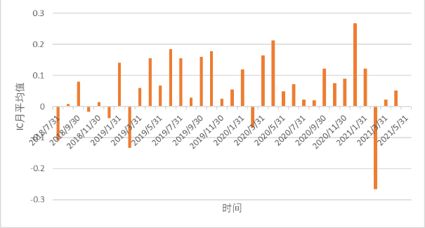
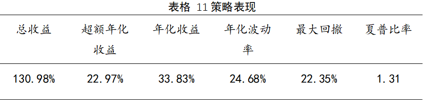

# assignment-3

## 逻辑描述和工作
本文尝试在研报基础上改进对不同类型的北向资金的选股能力进行探究， 本文选取的数据为WIND数据库中的陆港通机构持仓数据，时间范围为2018.07.03-2021.05.
19，原始数据包括每日每只股票的机构持仓数量情况，剔除掉其中的港股部分，以及机构代码缺失的机构:
  
静态因子：
使用每日每只股票由不同类资金持有的总数乘以该股票当日均价，表示该股票由不同类资金持有的总市值，计算总市值因子和日频IC，一周后周收益和一月后月收益的
Rank IC，计算得出不同收益频率下每天持仓情况的IC和对应IR。
  
从图中可以看出，随着2018年底北向资金开始大幅进入A股市场开始，北向资金有较为稳定的正IC表现，结合对不同频度收益的IC分析，我们可以发现银行类资金持仓
市值在较为长期的收益预测如月频收益中有较好表现，而券商类资金持仓市值则在如日频收益的短期收益预测中有相对优势。  
使用上述计算出的每只股票被不同资金持有的市值，除以当日该股票的A股流通市值，计算出该股票被北向资金持仓的市值占比，更合理地反映出北向资金对该股票未来收
益的影响，对IC的计算同上：
  
同样选取表现最好的月度收益IC序列，可以看出使用持仓市值占比因子对单纯的持仓市值因子有了较为明显的改善，对各个收益频率的预测能力和稳定性都有了提升，由
于持仓市值占比更能体现出北向资金对个股的投资的程度，北向资金持仓占比高的个股资金稳定性也有了提升，不会出现频繁地买卖情况，对收益率的预测就有了明显提升。  
综合来看两种静态因子对长期收益的预测能力更强，同时期限越长，银行类资金的相对优势也就越明显，持仓市值占比对各个频率的收益预测效果都要好于单纯使用持仓
市值，因为其更加合理地反映了北向资金对个股资金结构的影响，同时也更好地体现了北向资金选择倾向。  
计算单日以及一周每只股票由各类资金持有数量的变化情况，用该变化量乘以当日该股票均价，得出个股的不同资金对应每日增持市值因子，对IC计算结果如下：
  
  
对于动态因子，前两者使用的是增持市值的绝对值进行计算，增持比例因子则是使用增持市值的相对变化进行计算，使用各类资金增持市值除以增持前的持有市值计算得
出。增持比例更能反映出各类资金对于个股的增持倾向大小，而非增持资金对个股资金结构的影响。
  
  
上述的资金分类方法是基于机构类型，如果不考虑机构类型，采用持仓市值最高的机构作为分类标准，将原本的股票样本池换成每日持仓市值最高的20家机构持仓，
计算新的样本池中持仓市值占流通市值比这一因子因子对下月收益的IC表现，结果如下，其中横坐标为N，左轴为IR值，右轴为IC均值：
  
可以看出在持仓市值排名7、8位的机构对IC的贡献比较显著，将处于这一位置的机构列出后发现，造成这一结果的主要机构是摩根士丹利，其单独的持仓市值占比IC均
值可达6.31%，具体结果如下所示。
  

## 策略回测结果
回测区间：2018年7月31日-2021年4月30日
调仓频率：月度调仓
调仓日期：每个月首个一个交易日
基准：沪深300指数
  
  
  
  

